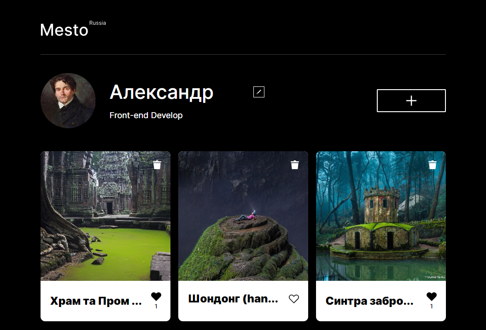
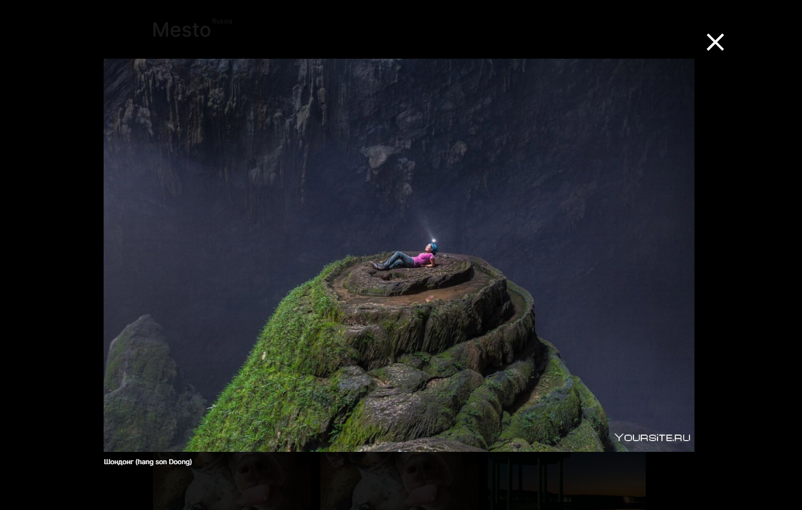

<h1 align="center">Проект: "Место"</h1>

## Описание проекта
Данная проектная работа составлена в рамках образовательной программы Яндекс Практикума. Проект представляет собой портирование на "Реакт" отзывчиво-адаптивного одностраничного сайта с профилем пользователя и фотокарточками, <a href="https://github.com/AlexanderGrams/mesto">созданного ранее</a>. 
## Методология и процесс создания
Работа разделена на несколько этапов:

1. Портирование  HTML-разметки, CSS-стилей, реализация открытия и закрытия 5 модальных окон (редактирование данных профиля, обновление аватара, добавление новой карточки, окно подтверждения удаления карточки и окно с увеличенным изображением карточки), загрузка данных с сервера

## Установка и запуск приложения
1. https://github.com/AlexanderGrams/mesto-react.git - клонировать репозиторий
2. npm i - установить зависимости
3. npm start - запустить приложение в режиме разработчика (ввести ссылку [http://localhost:3000](http://localhost:3000), для того чтобы увидеть в своем браузере). В процессе изменения кода страница будет автоматически перезагружаться

## Ссылка на проект
https://AlexanderGrams.github.io/mesto-react/